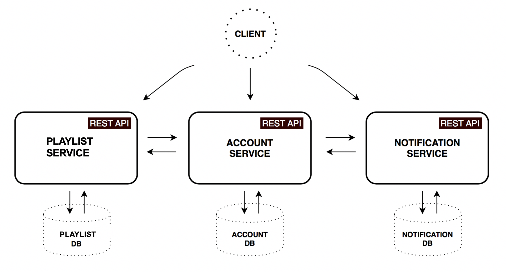
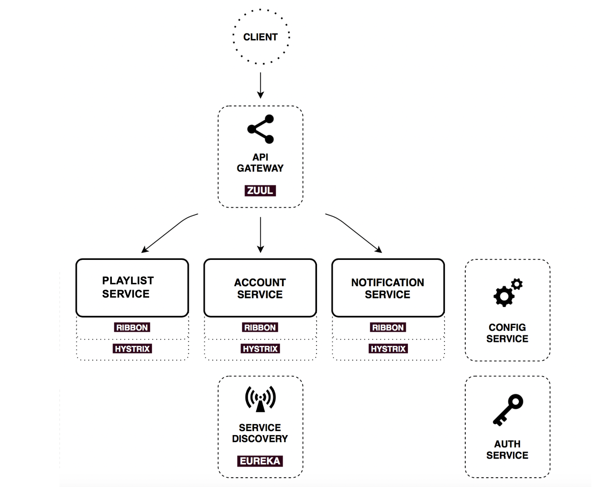
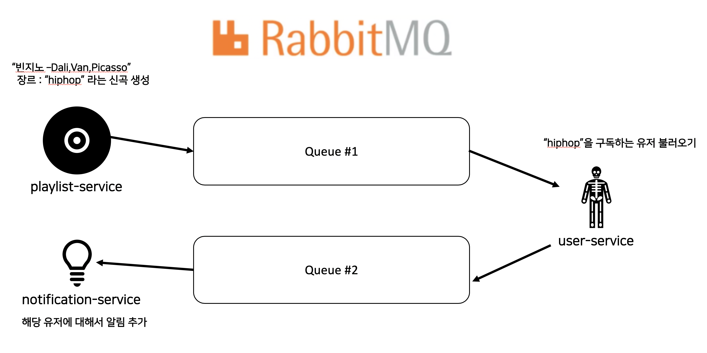

# Playlist API

Spring Boot, Spring Cloud와 Docker를 이용하여 개발된 Microservices 입니다.

**소스 코드** : https://github.com/p-jonghyun/Playlist-MSA

**개발 스펙
- Spring Boot & Cloud
- Netflix OSS
- RabbitMQ
- Docker & Docker Compose
- Maven
- Spring JPA
- Lombok
- QueryDSL
- Spring OAuth
- MessageSource 기반 exception 처리
- ApplicationEventPublisher와 스프링 @Async 기능으로 비동기적 이벤트 처리** 

## Microservices

- 3개의 core microservice들로 구성되어있습니다.
- 모든 서비스들은 independently deployable한 애플리케이션입니다.
- 서로의 서비스들은 독립적인 데이터베이스를 가지기 때문에, API 호출없이 서로의 데이터를 직접적으로 접근하지 못합니다.
- 서비스간의 통신은 RabbitMQ을 통하여 비동기적으로 통신하도록 하였습니다.

    

#### User service
Method	| Path	| Description	| User authenticated	| PAGING
------------- | ------------------------- | ------------- |:-------------:|:----------------:|
POST	| /users/signup	| 회원가입	| x | x 	
GET	| /users/{user_id}	| 회원 상세 정보 조회	| o | ×
GET	| /users	| 회원들 정보	| o | 	×


#### Playlist service
Method	| Path	| Description	| User authenticated	| PAGING
------------- | ------------------------- | ------------- |:-------------:|:----------------:|
POST	| /playlists	| 유저 플레이리스트 추가	| o | x 	
GET	| /playlists	| 유저의 플레이리스트들 조회	| o | x 
POST	| /playlists{playlist_id}	| 노래들을 플레이스트에 추가	| o | 	×
POST	| /albums	| 앨범 추가	| o | 	×
GET	| /albums?locale={locale}	| 앨범 조회(페이징)	| o | 	o
GET	| /albums/search?title={title}&locale={title}	| 앨범 검색	| o | 	×
GET	| /songs/{songId}	| 노래 상세 조회	| o | 	×


#### Notification service
Method	| Path	| Description	| User authenticated	| PAGING
------------- | ------------------------- | ------------- |:-------------:|:----------------:|
GET	| /notifications	| 새로운 알람 조회	| o | x 	
DELETE	| /notifications	| 알람삭제	| o | ×
GET	| /notifications/old	| 오래된 알람 조회	| o | 	×

## Infrastructure



## Auth

- OAuth2 token를 통하여 백엔드 resource services들을 보호하도록 하였습니다.
- 해당 프로젝트에서

    - Password Crenditals grant type : User Authorization

    - Client Crenditials : Microservices authorization

    이 이용되었습니다.

## API Gateway & Service Discovery

- 서비스들은 서로 다른 서버에 구축되어 있는데, 클라이언트의 편의를 위하여 single entry point인 API Gateway를 제공합니다.
- 사용자의 요청들을 적절히 백엔드 리소스들로 라우팅을 합니다.

```yaml
예제 ) 

zuul:
  routes:
    user-service:
      path: /users/**
      stripPrefix: false
```

## RabbitMQ을 이용한 알람 서비스 제공

- 해당 프로젝트에서 사용자들은 자신이 구독한 지역과 장르를 가지는 새로운 노래들과 앨범에 대하여 알람을 받을 수 있습니다.

    

```java
@Autowired
private RabbitTemplate rabbitTemplate;

@EventListener
public void handleSongCreatedEvent(SongCreatedEvent songCreatedEvent) {

    ObjectMapper objectMapper = new ObjectMapper();
    Song song = songCreatedEvent.getSong();
    List<Genre> genres = song.getGenres();

    String title = "새로운 노래 출시 알림";

    for(Genre genre : genres) {
        String msg = "구독하신 장르 " + genre + "의 새로운 노래 " + song.getTitle() + " 이 출시되었습니다!";
        AlbumDto.RabbitSenderData data = new AlbumDto.RabbitSenderData(title, msg, String.valueOf(genre));

        String json = null;

        try {
            json = objectMapper.writeValueAsString(data);
            rabbitTemplate.convertAndSend("q.requestUsersWithNoti.genre", json);
        } catch (IOException e) {
            e.printStackTrace();
        }

    }
}
```

## 비동기 이벤트 기반으로 알림 처리

- ApplicationEventPublisher & @Async 기능을 사용하여 별도의 쓰레드에서 비동기 이벤트 기반 알림 처리
- 노래 생성하는 로직 ↔ 알림 생성하는 로직 분리

```java
@Configuration
@EnableAsync
@Slf4j
public class AsyncConfig implements AsyncConfigurer {

    @Override
    public Executor getAsyncExecutor() {
        ThreadPoolTaskExecutor executor = new ThreadPoolTaskExecutor();
        int processors = Runtime.getRuntime().availableProcessors();
        log.info("processors count {}", processors);
        executor.setCorePoolSize(processors);
        executor.setMaxPoolSize(processors * 2);
        executor.setQueueCapacity(50);
        executor.setKeepAliveSeconds(60);
        executor.setThreadNamePrefix("AsyncExecutor-");
        executor.initialize();
        return executor;
    }
}
```

```java
public Album create(AlbumDto.createAlbumReq dto) {

        Album album = dto.toEntity();

        album.getSongs().stream()
                .forEach(
                        song -> {
                            song.setAlbum(album);
                            eventPublisher.publishEvent(new SongCreatedEvent(song));
                        }
                );
        eventPublisher.publishEvent(new AlbumCreatedEvent(album));
        return albumRepository.save(album);
    }
```

- eventPublisher.publishEvent()를 통한 비동기 처리

## N+1 문제와 MultipleBagFetchException 해결 전략

- @OneToOne, @ManyToOne은 FetchJoin을 적용
- @OneToMany, @ManyToMany은 가장 데이터가 많은 자식에 Fetch Join
    - 그 외 자식들은 spring.jpa.properties.hibernate.default_batch_fetch_size=1000로 10~1000개의 in쿼리로 성능으 로 최대한 보장

```java
query = from(qAlbum)
        .leftJoin(qAlbum.songs, QSong.song).fetchJoin()
        .distinct();
```

- QueryDSL을 이용한 fetchJoin 다른 many관계들도 같이 fetchJoin을 하면 MultipleBagFetchException이 발생하여 제일 많은 데이터를 가진 자식만 fetchjoin 실행
